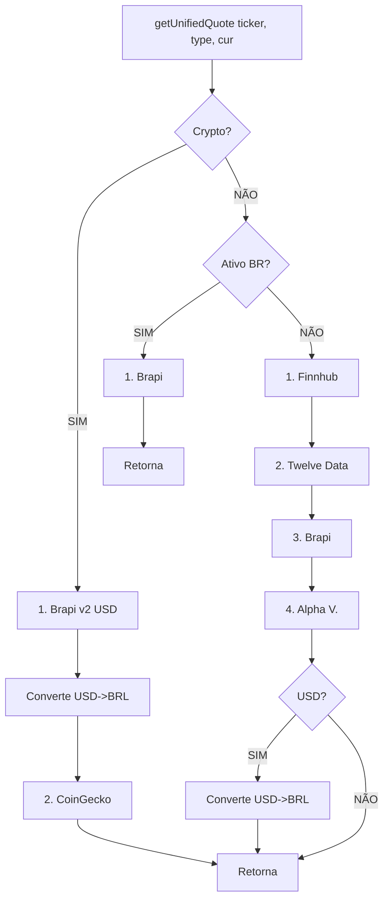

# Guia de Integração de APIs - FinControl

## Sistema Unificado de Cotações

### Visão Geral

O sistema agora usa uma arquitetura unificada com fallback automático entre múltiplas APIs:

1. **Brapi v2** (Prioridade 1 - Stocks BR e Crypto)
2. **Finnhub** (Prioridade 2 - Stocks dos EUA, ETFs, REITs)
3. **Twelve Data** (Prioridade 3 - Stocks dos EUA alternativo)
4. **CoinGecko** (Fallback para criptomoedas)
5. **Alpha Vantage** (Fallback final para stocks dos EUA)

```typescript
import { getUnifiedQuote } from "@/lib/api/unified-quote-service"

// Busca automática com fallback
const quote = await getUnifiedQuote("PETR4", "stock", "BRL")
console.log(`Preço: ${quote.price} (Fonte: ${quote.source})`)
```

### Unified Quote Service

#### Buscar Cotação com Fallback Automático

```typescript
import { getUnifiedQuote, getHistoricalPrice } from "@/lib/api/unified-quote-service"

// Cotação atual
const quote = await getUnifiedQuote(
  "BTC",           // ticker
  "crypto",        // tipo: "stock" | "crypto"
  "BRL"            // moeda
)

// Cotação histórica
const historicalPrice = await getHistoricalPrice(
  "PETR4",         // ticker
  "2024-01-15",    // data
  "stock",         // tipo
  "BRL"            // moeda
)
```

#### Resposta Unificada

```typescript
interface UnifiedQuote {
  symbol: string           // Ticker/símbolo
  name: string            // Nome do ativo
  price: number           // Preço atual
  change: number          // Variação em valor absoluto
  changePercent: number   // Variação percentual
  currency: string        // Moeda (BRL, USD)
  source: "brapi" | "finnhub" | "twelveData" | "coingecko" | "alphavantage" | "fallback"
}
```

### Conversão Automática de Moedas

O sistema agora converte automaticamente USD para BRL usando cotação real do dólar:

```typescript
// Criptomoedas: Brapi retorna USD, converte para BRL
const btc = await getCryptoCotacao("BTC", "BRL")
// USD price * taxa do dólar = BRL price
// Ex: $95,000 * 5.80 = R$ 551,000

// Stocks dos EUA: Converte se necessário
const apple = await getUnifiedQuote("AAPL", "stock", "BRL")
// Retorna em BRL automaticamente
```

## Brapi API

### Autenticação

Todas as requisições devem incluir o token no header:

```typescript
headers: {
  Authorization: `Bearer ${process.env.BRAPI_TOKEN}`,
  Accept: "application/json"
}
```

### Endpoints Disponíveis

#### 1. Cotações de Ações (`/api/quote/{tickers}`)

```typescript
// Cotação única
GET https://brapi.dev/api/quote/PETR4?fundamental=false

// Múltiplas cotações
GET https://brapi.dev/api/quote/PETR4,VALE3,ITUB4?fundamental=false

// Resposta
{
  "results": [
    {
      "symbol": "PETR4",
      "shortName": "PETROBRAS",
      "regularMarketPrice": 38.50,
      "regularMarketChange": 0.75,
      "regularMarketChangePercent": 1.98,
      "regularMarketDayHigh": 39.20,
      "regularMarketDayLow": 37.80,
      ...
    }
  ]
}
```

#### 2. Lista de Ativos (`/api/quote/list`)

```typescript
GET https://brapi.dev/api/quote/list?sortBy=name&type=stock&sector=Financeiro

// Filtros disponíveis
- search: Busca por nome ou ticker
- sortBy: name, close, change, volume
- sortOrder: asc, desc
- limit: Limite de resultados
- page: Paginação
- type: stock, fund (FII)
- sector: Setor econômico
```

#### 3. Ativos Disponíveis (`/api/available`)

```typescript
GET https://brapi.dev/api/available?search=PETR

// Resposta
{
  "stocks": ["PETR3", "PETR4"]
}
```

#### 4. Criptomoedas (`/api/v2/crypto`)

**IMPORTANTE**: A API Brapi v2 retorna preços de criptomoedas sempre em USD. O sistema converte automaticamente para BRL usando a taxa de câmbio atual.

```typescript
GET https://brapi.dev/api/v2/crypto?coin=BTC&currency=USD

// Resposta da API (sempre USD)
{
  "coins": [
    {
      "coin": "BTC",
      "currency": "USD",
      "coinName": "Bitcoin",
      "regularMarketPrice": 95000.00,  // USD
      "regularMarketChange": 1500.00,
      "regularMarketChangePercent": 1.60,
      ...
    }
  ]
}

// O serviço converte automaticamente:
const usdToBrl = await getUSDtoBRL()  // Ex: 5.80
const priceInBRL = 95000.00 * 5.80   // R$ 551,000.00
```

#### Taxa de Câmbio (`/api/v2/currency`)

```typescript
// Busca cotação USD/BRL atualizada
GET https://brapi.dev/api/v2/currency?currency=USD-BRL

// Resposta
{
  "currency": [
    {
      "currency": "USD-BRL",
      "name": "Dólar Americano/Real Brasileiro",
      "bidPrice": 5.8015,
      "askPrice": 5.8025,
      ...
    }
  ]
}
```

## APIs para Stocks dos EUA (ETFs, REITs, Ações)

### Finnhub API

API gratuita para stocks, ETFs e REITs dos EUA em tempo real.

```typescript
// Configurar em .env.local
FINNHUB_API_KEY=sua_chave_aqui

// Buscar cotação
GET https://finnhub.io/api/v1/quote?symbol=AAPL&token=YOUR_KEY

// Resposta
{
  "c": 185.50,    // current price
  "d": 2.50,      // change
  "dp": 1.37,     // change percent
  "h": 186.20,    // high
  "l": 184.10,    // low
  "o": 184.50,    // open
  "pc": 183.00    // previous close
}

// Vantagens:
- ✅ Gratuito para uso básico
- ✅ Dados em tempo real
- ✅ 60 chamadas/minuto (free tier)
- ✅ Suporte a ETFs e REITs

// Obter API Key: https://finnhub.io/register
```

### Twelve Data API

API alternativa para stocks dos EUA com dados detalhados.

```typescript
// Configurar em .env.local
TWELVE_DATA_KEY=sua_chave_aqui

// Buscar cotação
GET https://api.twelvedata.com/quote?symbol=AAPL&apikey=YOUR_KEY

// Resposta
{
  "symbol": "AAPL",
  "name": "Apple Inc",
  "close": 185.50,
  "change": 2.50,
  "percent_change": 1.37,
  "high": 186.20,
  "low": 184.10,
  "open": 184.50,
  "previous_close": 183.00,
  "volume": 50000000
}

// Vantagens:
- ✅ 8 req/min (free tier)
- ✅ Dados detalhados
- ✅ ETFs e stocks

// Obter API Key: https://twelvedata.com/pricing
```

### Implementação Recomendada

#### Service Layer com Fallbacks

```typescript
// lib/api/unified-quote-service.ts
export async function getUnifiedQuote(
  ticker: string,
  assetType: "stock" | "crypto",
  currency: "BRL" | "USD" = "BRL"
): Promise<UnifiedQuote | null> {
  
  if (assetType === "crypto") {
    const brapiQuote = await getCryptoCotacao(ticker, currency)
    if (brapiQuote) return convertToBrapiFormat(brapiQuote)
    
    const geckoQuote = await fetchFromCoinGecko(ticker, currency)
    if (geckoQuote) return geckoQuote
    
    return null
  }
  
  const brapiQuote = await getBrapiCotacao(ticker)
  if (brapiQuote) {
    // Converte USD para BRL se necessário
    if (brapiQuote.currency === "USD" && currency === "BRL") {
      const usdToBrl = await getUSDtoBRL()
      return {
        ...brapiQuote,
        price: brapiQuote.price * usdToBrl,
        change: brapiQuote.change * usdToBrl,
        currency: "BRL"
      }
    }
    return brapiQuote
  }
  
  // Fallback para APIs de stocks dos EUA
  const usStockQuote = await getUSStockQuote(ticker)
  if (usStockQuote) {
    // Converte para BRL se necessário
    if (currency === "BRL" && usStockQuote.currency === "USD") {
      const usdToBrl = await getUSDtoBRL()
      return {
        ...usStockQuote,
        price: usStockQuote.price * usdToBrl,
        change: usStockQuote.change * usdToBrl,
        currency: "BRL"
      }
    }
    return usStockQuote
  }
  
  return null
}
```

#### Serviço de Conversão de Moeda

```typescript
// lib/api/crypto-service.ts
export async function getUSDtoBRL(): Promise<number> {
  try {
    // Busca cotação do dólar via Brapi
    const url = `${BRAPI_BASE_URL}/v2/currency?currency=USD-BRL`
    const response = await fetch(url, {
      cache: "no-store",
      signal: AbortSignal.timeout(5000),
      headers: {
        Authorization: `Bearer ${BRAPI_TOKEN}`,
        Accept: "application/json",
      },
    })

    if (response.ok) {
      const data = await response.json()
      if (data.currency && data.currency[0]?.bidPrice) {
        return parseFloat(data.currency[0].bidPrice)
      }
    }
  } catch (error) {
    console.log("[v0] Failed to fetch USD/BRL rate, using fallback")
  }

  // Fallback para taxa estimada (atualizar periodicamente)
  return 5.80
}
```

### Exemplos de Uso

#### Buscar Ação Brasileira

```typescript
import { getUnifiedQuote } from "@/lib/api/unified-quote-service"

const quote = await getUnifiedQuote("PETR4", "stock", "BRL")
if (quote) {
  console.log(`${quote.name}: R$ ${quote.price}`)
  console.log(`Variação: ${quote.changePercent}%`)
  console.log(`Fonte: ${quote.source}`)
}
```

#### Buscar Stock dos EUA

```typescript
const quote = await getUnifiedQuote("AAPL", "stock", "BRL")
if (quote) {
  console.log(`Apple: R$ ${quote.price} (convertido de USD)`)
  console.log(`Fonte: ${quote.source}`)
}

// Ou em USD
const quoteUSD = await getUnifiedQuote("AAPL", "stock", "USD")
if (quoteUSD) {
  console.log(`Apple: $${quoteUSD.price}`)
}
```

#### Buscar ETF ou REIT

```typescript
// ETF
const spy = await getUnifiedQuote("SPY", "stock", "BRL")
console.log(`S&P 500 ETF: R$ ${spy.price}`)

// REIT
const reit = await getUnifiedQuote("O", "stock", "BRL")
console.log(`Realty Income: R$ ${reit.price}`)
```

#### Buscar Criptomoeda

```typescript
const crypto = await getUnifiedQuote("BTC", "crypto", "BRL")
if (crypto) {
  console.log(`Bitcoin: R$ ${crypto.price.toLocaleString('pt-BR')}`)
  console.log(`Variação: ${crypto.changePercent}%`)
  console.log(`API usada: ${crypto.source}`)
}

// Exemplo de saída:
// Bitcoin: R$ 551.000,00
// Variação: 1.60%
// API usada: brapi
```

## Fluxo de Decisão de APIs



## Configuração de Variáveis de Ambiente

No **Vars** da sidebar do v0, adicione:

```bash
# Obrigatório para melhor performance
BRAPI_TOKEN=seu_token_aqui

# Recomendado para stocks dos EUA
FINNHUB_API_KEY=sua_chave_aqui

# Opcionais para fallback adicional
TWELVE_DATA_KEY=sua_chave_aqui
ALPHA_VANTAGE_KEY=sua_chave_aqui
```

**Como obter tokens:**

1. **Brapi**: https://brapi.dev/dashboard (gratuito com limites)
2. **Finnhub**: https://finnhub.io/register (gratuito - 60 req/min)
3. **Twelve Data**: https://twelvedata.com/pricing (gratuito - 8 req/min)
4. **Alpha Vantage**: https://www.alphavantage.co/support/#api-key (gratuito - 5 req/min)

## Próximas Integrações

- [x] Brapi v2 (stocks BR e crypto)
- [x] Finnhub (stocks EUA, ETFs, REITs)
- [x] Twelve Data (stocks EUA alternativo)
- [x] CoinGecko (crypto alternativo)
- [x] Alpha Vantage (stocks americanos)
- [x] Conversão automática USD->BRL
- [ ] Binance API (crypto real-time)
- [ ] Status Invest (fundamentalista)
- [ ] B3 Official API (institucional)

## Solução de Problemas

### Erro 429 (Too Many Requests)

**Sintoma**: `Brapi API error: 429 Too Many Requests`

**Solução**: O sistema agora processa tickers sequencialmente com delay de 300ms entre chamadas. Se persistir, o fallback para outras APIs será usado automaticamente.

### Erro 404 (Ativo Não Encontrado)

**Sintoma**: `No quote found for {ticker}`

**Solução**: 
1. Verifique se o ticker está correto
2. Para ações BR, use formato sem .SA (ex: PETR4, não PETR4.SA)
3. Para stocks dos EUA, use ticker sem sufixo (AAPL, SPY, O)
4. Para criptos, use símbolo curto (BTC, ETH, não bitcoin)
5. O sistema tentará múltiplas APIs automaticamente

### Preço de Cripto Incorreto (muito baixo)

**Sintoma**: Bitcoin mostrando R$ 38 em vez de R$ 551.000

**Causa**: API retornava USD mas sistema não estava convertendo para BRL

**Solução**: Sistema agora busca taxa USD/BRL e converte automaticamente. Se o problema persistir:
1. Verifique logs no console: `[v0] Converted BTC: 95000 USD -> 551000 BRL`
2. Confirme que BRAPI_TOKEN está configurado nas Vars
3. Taxa de fallback é R$ 5,80 (atualizada periodicamente)

### Stocks dos EUA Não Aparecem

**Sintoma**: AAPL, SPY, O etc não retornam cotação

**Solução**:
1. Configure FINNHUB_API_KEY nas Vars (recomendado)
2. Sistema tentará: Brapi -> Finnhub -> Twelve Data -> Alpha Vantage
3. Verifique logs: `[v0] Trying Finnhub for AAPL`
4. Sem API keys, apenas Brapi funcionará (cobertura limitada de stocks EUA)

### Cotação Não Atualiza

**Sintoma**: Preços desatualizados ou sempre os mesmos

**Solução**:
1. Verifique conexão com internet
2. Veja logs no console para identificar qual API falhou
3. Sistema usa fallback automático - se todas APIs falharem, erro será exibido
4. Para criptos, verifique se a conversão USD->BRL está acontecendo

### Preço Histórico Indisponível

**Sintoma**: "Preço histórico indisponível. Usando cotação atual."

**Solução**: Para datas antigas (>7 dias para crypto, >30 dias para ações), APIs gratuitas podem não ter dados. O sistema usa preço atual como fallback automaticamente.
